# Integrate Dynatrace with Azure Devops

Azure Devops provides multiple development collaboration tools. For this Workshop we will be using the following tools to create a high performant, resilient, self- healing pipeline:
*Azure Repos:* Source control repository for the test application. You can read more on Azure Repos [here](https://docs.microsoft.com/en-us/azure/devops/repos/?view=vsts). 
*Azure Pipelines:* Creating CI/CD pipelines for deploying the test application. You can read more on Azure Devops Pipelines [here](https://docs.microsoft.com/en-us/azure/devops/pipelines/index?view=vsts). 

## Additional Utilities – 

**Azure Devops Extension:** Deployed in Azure Marketplace: Contains – 

*Push Deployment to Dynatrace Task –* The task pushes a Deployment event to Dynatrace when a new version of the application is deployed. It uses the Dynatrace events API to publish the details of the Deployment. The event requires URL to the Dynatrace Tenant, API token, Tag Name and Context (Note the Tag needs to be available in Dynatrace for the event to show up).  

*Unbreakable Pipeline Release Gate –* The quality gate is executed to test the quality of the current build in Staging against a Monspec file. In the case that there are no violations the gate succeeds and pushes the code to Production. In case there are reported Violations then the Release Pipeline fails and the code is not deployed to Production. 

**Azure Functions:** There are two functions being deployed:

*Self Healing Function:* This function will redeploy a good build in the event that the bad build has made it to production upon receiving a Performance issue from Dynatrace. 

*Unbreakable Release gate Function:* This is called post deployment from Staging to validate the build
Azure Storage account: Used for storing the monspec file and the pipelineinfo files. 

**Azure Proxy:** Dynatrace Proxy: Utility with Dynatrace cli installed for comparing the Performance information with the monspec file. 

## Pre Requisites
1. Azure Devops Account. You can [get one here](https://azure.microsoft.com/en-ca/services/devops/)
2. Azure Account. You can [get one here](https://azure.microsoft.com/en-us/)
3. Dynatrace Account. [Start your free SaaS trial](https://www.dynatrace.com/trial/)
4. Copy this Github repo to your file system

## Preparation

Microsoft Azure
Upload the Monspec files to Azure Storage Account: Create a Storage account in Microsoft Azure and upload the files in Monspec folder to the Storage Account. Be sure to give the Blob -  Container (anonymous read access for containers and blobs) Access Policy. Copy the URLs to both Monspec file and Pipeline Info files in Azure_Devops_Values.txt 
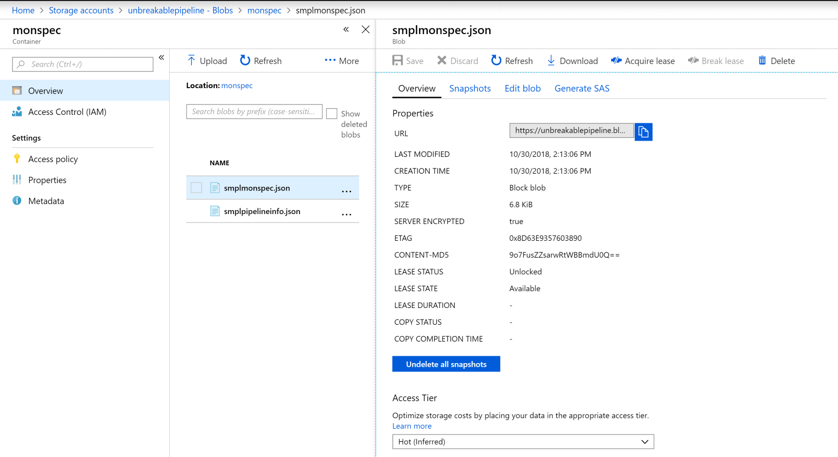

Azure Devops 
1. Create a New Organization and a new Project into Azure Devops
2. Import the source code from this repo into Azure Repos:
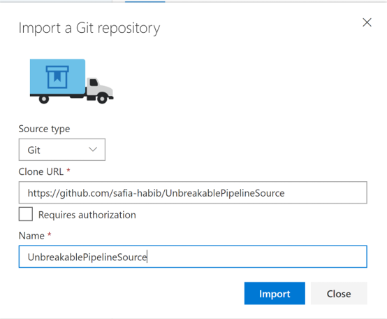
3. Create Personal Access Token - This is required for communication between Azure Devops and Microsoft Azure. You can read more about PATs [here] (https://docs.microsoft.com/en-us/azure/devops/organizations/accounts/use-personal-access-tokens-to-authenticate?view=vsts) 
4. Install the Dynatrace Unbreakable Pipeline Marketplace Extension: Installing the extension will give the Dynatrace push Deployment task and the Dynatrace Unbreakable Pipeline Releasae Gate. 
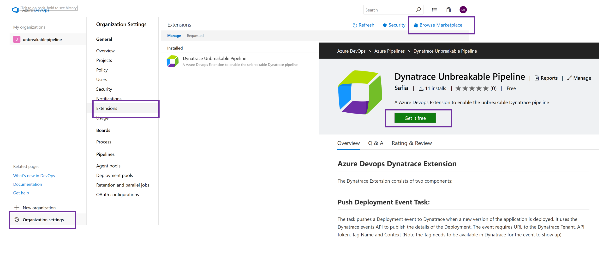
5. Create Deployment Group: The release pipeline will create two VM's (Staging and Production) in Microsoft Azure and deploy the app into these VM's. 
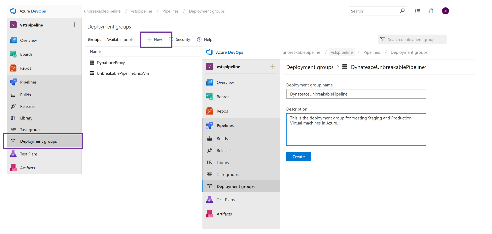

Dynatrace
We need a couple of things from Dynatrace before we launch the Release Pipeline
1. Your Dynatarce Tenant URL 
2. Your Dynatrace Tenant Token : You can get both these from Deploy Dynatrace -> Start Installation -> Linux
Tenant URL looks like: https://XXXXX.live.dynatrace.com
Tenant Token is specified as Api-Token in the URL portion of the wget command. 
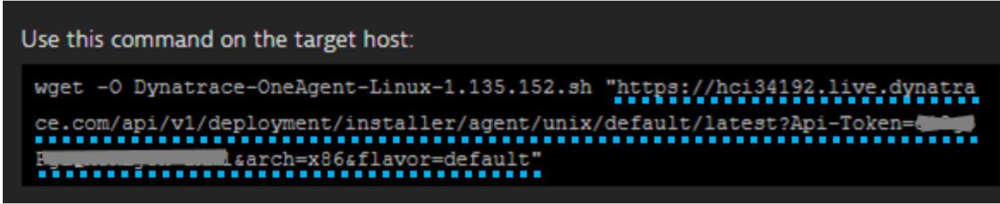
3. Your Dynatrace API Token: Go to Settings -> Integration -> Dynatrace API -> Generate token 
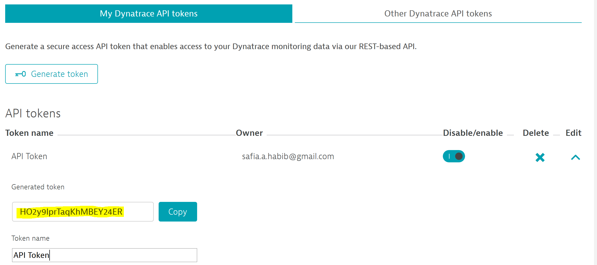
Copy all the values into the Azure_Devops_Values.txt 

## Continous Integration 
We have two pipelines for this workshop - Continous Integration / Build Pipeline
In Azure Devops go to Pipelines -> Builds and Import UnbreakablePipeline-CI.json
Ensure that the Source points to the Source directory you have created in Azure Repos. We have noticed that you will need to update the Get Sources step of the Build Pipeline 
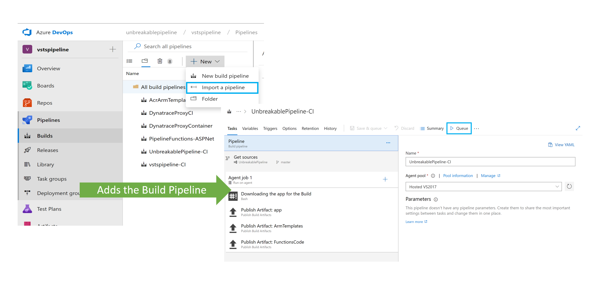

Queue the Build once you have ensured that the source points to the right repo. 

What Happens in Continous Integration: All the source code is compiled and made available for the Deployment stage. This Build Pipeline will emit 3 Artifact folders: 
Arm Templates: Containing the Azure Resource Manager Templates for Unbreakable gate Function,  Self Healing Function, Virtual Machines template. These templates define the resources to be created in Azure (size, name, Resource Group, other properties).
App: The Node.js app we will use to test out the Unbreakable Pipeline
Functions Code: The code for the Unbreakable Pipeline gate Function and Self Healing Function.
You can inspect these by going to the build -> Artifacts: 

We will use these in our Next step to Finish the Deployment 

## Continous Deployment
We will be deploying two Pipelines:
1. Create Utilities: This pipeline will create the rquired utilities in Microsoft Azure - Two Functions and two VM's which we will use in our next Pipeline to Deploy the App and monitor it with Dynatrace 
* Import the CreateUtilities.json file into a Release Pipelines: 

* After importing you will need to first update the Artifacts folder to Point to your Build Pipeline. Go to Each individual task and select the right Azure Subscription to Deploy to. 
* Ensure the Name for the Deploy App service matches the Function Names you have provided in functionarmTemplate.parameters.json
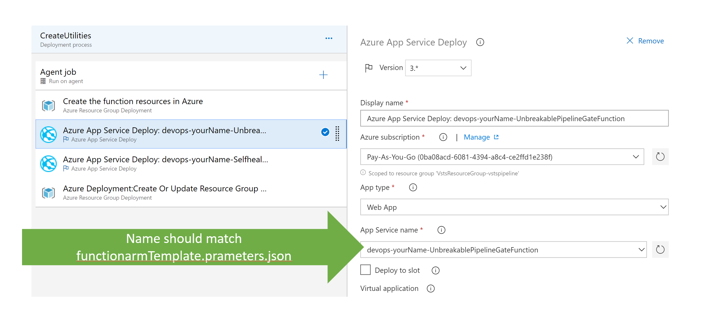
* Ensure the name of the Deployment Group matches the Deployment Group created earlier in Preparation step. You will also need to establish connection to Azure Portal using the PAT we already created. The Connection URL is of the format - https://dev.azure.com/<YOUR_ORGANIZATION_NAME> (usually till the first slash in the URL)
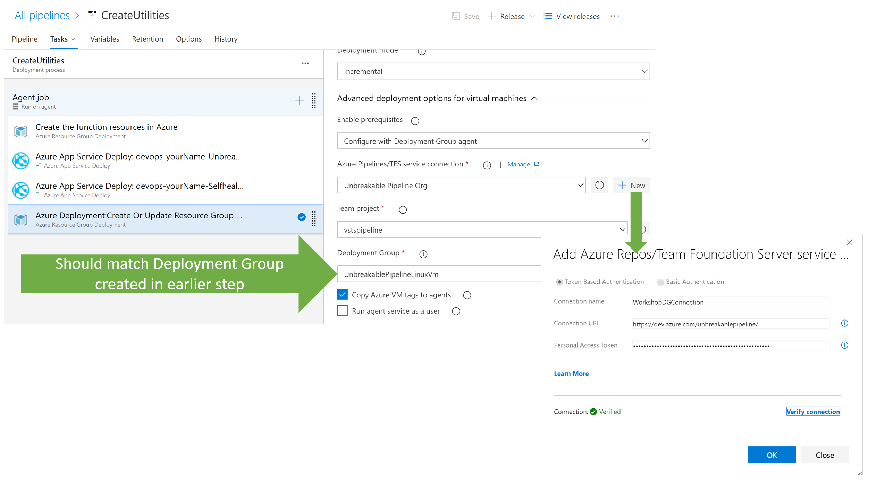
*You might run into errors with the cores you have available in Azure and the location you selected. Make sure you have access to deploy resources in Azure*

Create a Release for the Pipeline. This will start creating the required resources in Azure. Once successful see the resources in Azure: 

Get the URL for the Functions: Copy it in Azure_Devops_Values.txt
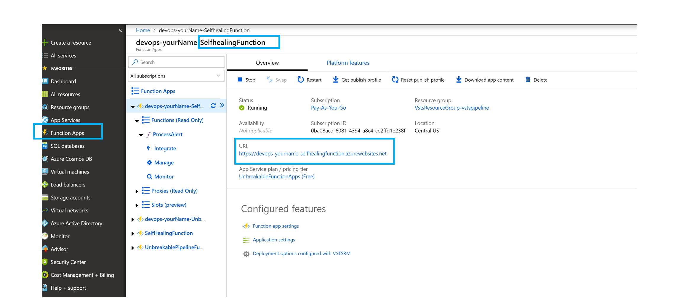
Grab the Value of the Function Key for UnbreakablePipelineGate Function:  Copy it in Azure_Devops_Values.txt
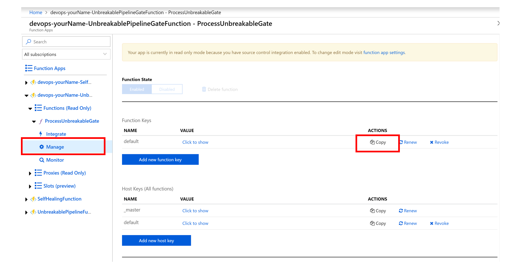

2. Unbreakable Pipeline: Now we will deploy our App and Simulate the Unbreakable Pipeline
* Import the UnbreakablePipeline-CD.json into Release Pipeline
* Delete the existing Artifact and add a new Artifcat pointing to the Build Pipeline you created earlier
* Go to each stage and re-populate the values for Azure Subscription
* For each task provide the right value for the Deployment Group Tag(Staging for Staging stage and Production for Production stage) 
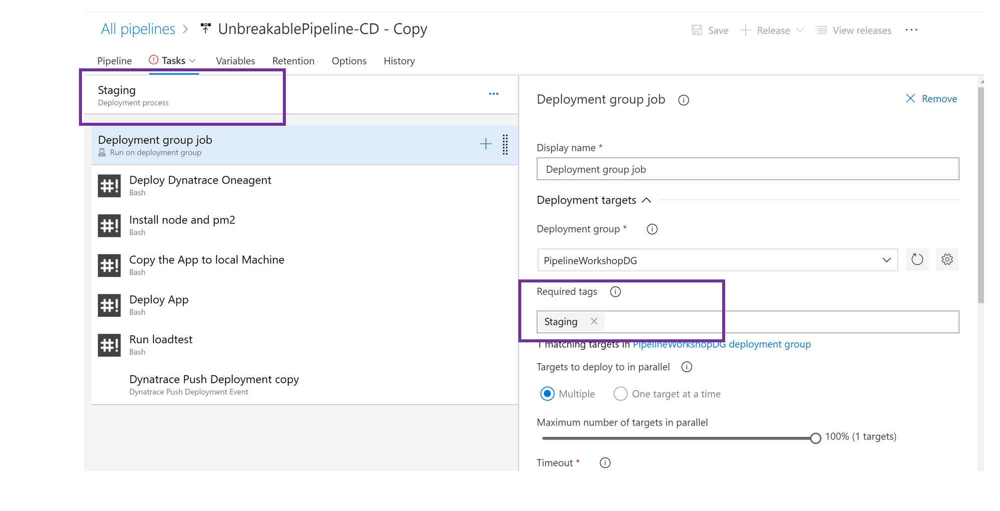 
* Add the values for the Dynatrace Environment in Variables: 
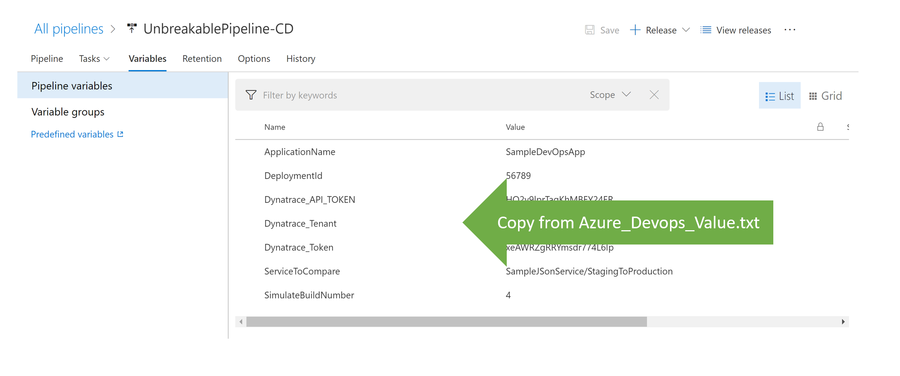
* SimulateBuildNumber variable - Our App has 4 Builds
  * SimulateBuildNumber 1 - App Runs well in Both Staging and Production
  * SimulateBuildNumber 2 - App starts failing in Staging (Shift Left -> Do not let the bad build to go to Production) 
  * SimulateBuildNumber 3 - App runs well in both Staging and Production
  * SimulateBuildNumber 4 - App runs well in Staging and starts failing in Production - To test Self Healing
* Inspect the tasks in the Pipeline
  * Deploy Dynatrace: This task will deploy Dynatrace OneAgent on the VM's we created in Azure 
  * Dynatrace Push Deployment: This task is from the extension and pushes the Deployment task into Dynatrace 
    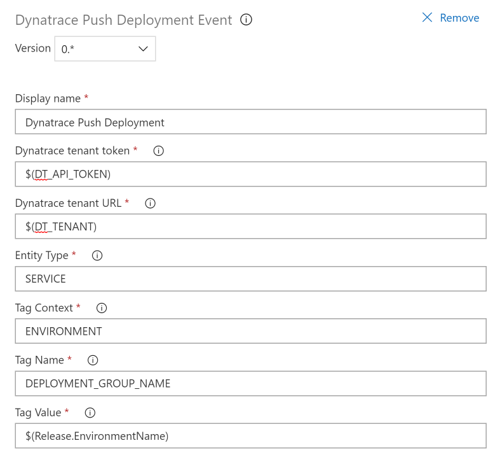
* Configure the Release Gate with the values from Azure_Devops_Values.txt
  The value for Dynatrace proxy is: http://40.117.92.217:5000/api/DTCLIProxy/MonspecPullRequest
  This is currently hosted by Dynatrace and we are working hard to remove the dependency. 

* Create a Release

## Configure Self Healing
* Configure Self Healing Function in Azure: SelfHealingFunction -> Application settings
Add the following settings and provide the values from Azure_Devops_Values.txt
DT_API_TOKEN, DT_TENANT_URL, DT_VSTSPAT (Personal Access Token), DT_VSTSURL
This function rolls back to a previous good build when invoke. In order for it to do that it needs to access the Dynatrace API and the Azure Devops API. 
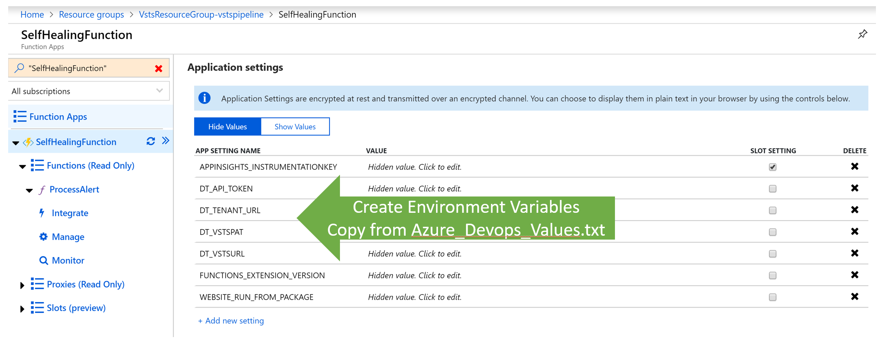
* Add the Self Healing Function Web Hook to Dynatrace: Settings -> Integration -> Problem Notifications -> Custom Interation:
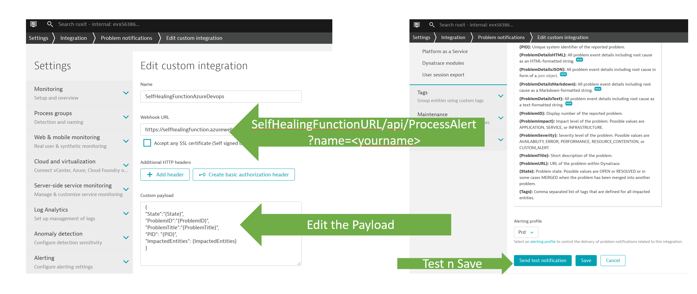
  * Note - The URL to looks like: selfHealingURL/api/ProcessAlert?name=<YourName>
  * Custom Payload looks like this: 
    {
     "State":"{State}",
     "ProblemID":"{ProblemID}",
     "ProblemTitle":"{ProblemTitle}",
     "PID": "{PID}",
     "ImpactedEntities": {ImpactedEntities}
    }

## Result
* Deploying various Builds - Simulating Build Number 1
Push Deployment Event task pushes the Deployment into Dynatrace: 
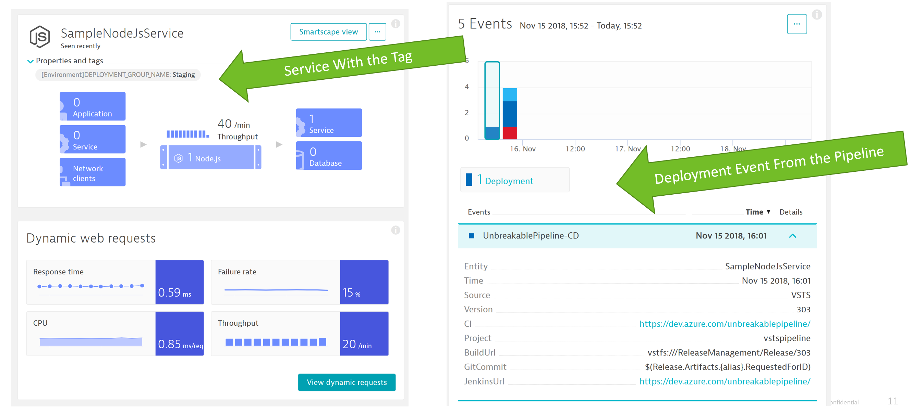

Pipeline in Azure Devops
The pipeline goes through and deploys the app in both Staging and Production: 
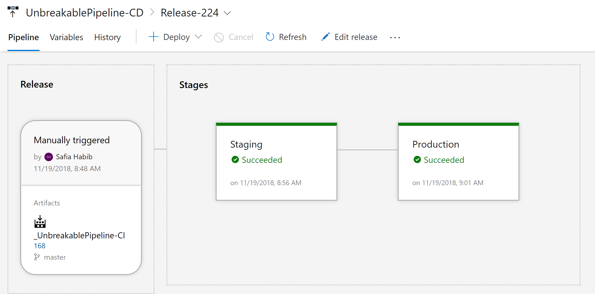

* Deploying Build Number 2: 
The app starts failing: View in Dynatrace: 

Release Gate does not let the bad build go through Production: When the Performance Signature does not look good the Release gate does not let the build pass through and deployment to Production does not happen:
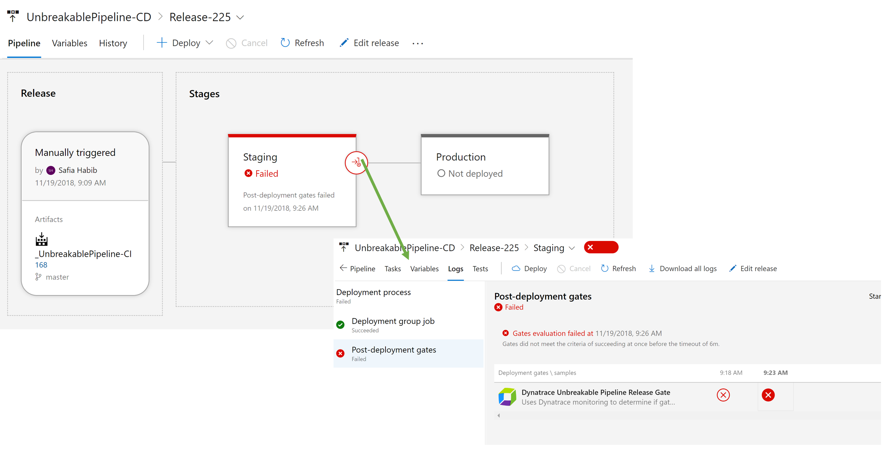

* Deploying Build Number 4 
  The app deploys to Production and Dynatrace creates an alert which calls the Self Healing Function: 
  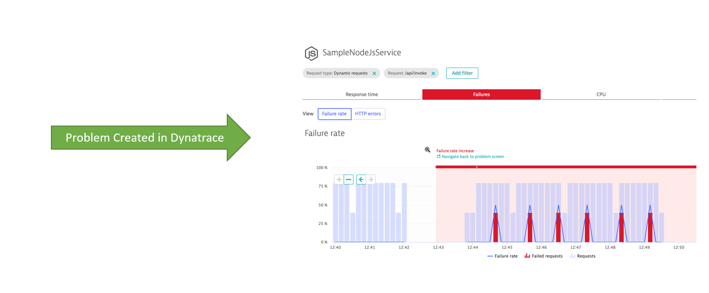
  Take a look at the Self Healing Function Logs in Azure  
  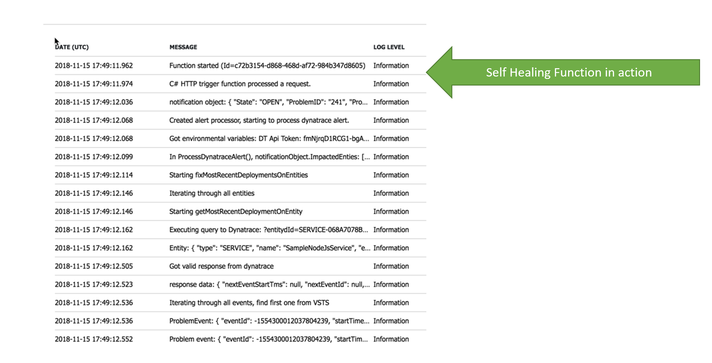
  The Self Healing Function Reverts the release back in Azure Devops 
  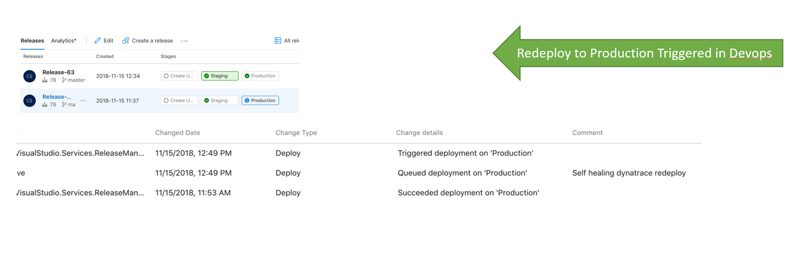
  The problem is resolved in Dynatrace
  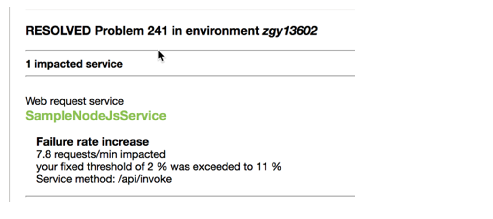

